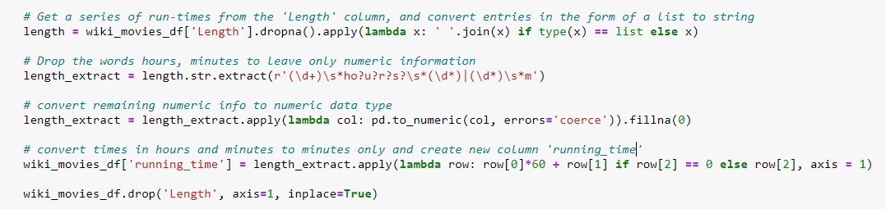
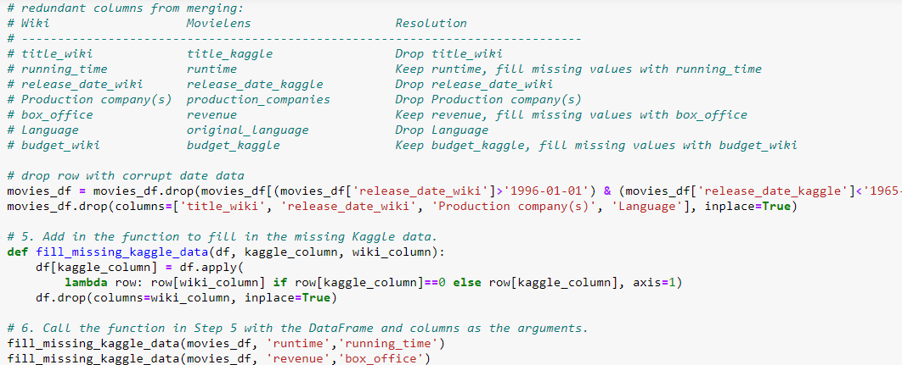
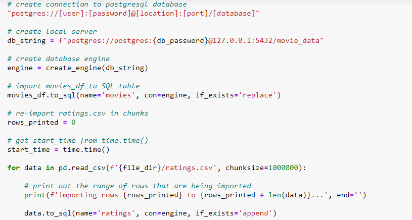

# Movies_ETL

## Resources
Python 3.7.9, jupyeter notebook 6.1.4, postgreSQL 11.10, pgAdmin 4.29, SQLAlchemy

## Overview

The purpose of this project is to extract, transform, and load data about various movies from separate sources into a movies SQL database to make available for a hackathon. I used a jupyter notebook to explore data scraped from the sidebars of movies' wikipedia pages into a JSON file. I then performed similar cleaning tasks on a csv file of movie metadata from from MovieLens and merged the kaggle and wikipedia movies dataframes.

### Wikipedia Data Cleaning

- Load the JSON and create a function to clean the JSON that will:
    - Create list of movie objects from JSON
        - Filtering for entries that do not have a director
        - Filtering out entries that are tv shows instead of movies
        
    - Consolidate all key/values for alternate titles into one key (to later create a single column in a pandas dataframe)
        
    - Consolidate equivalent keys (ie 'Director' and 'director') into single key
        
- Convert list of objects into pandas dataframe
- Drop null values and duplicates

- Convert dollar amounts expressed in text (ie $10 billion) to numeric data types
    
######Start Here to CONTINUE REFORMATING######

data forms-such as dates in various formats and dollar amounts represented with words million or billion-were transformed and made more consistent, and data types were corrected. Below is a sample of code used clean the "Length" column, which held the length of each movie listed in various text formats such as "1 hour 15 min" or "120 minutes", creating a new "running_time" column with length given in total minutes in with a numerica datatype.

From that cleaned data, a wiki_movies_df was created.  

### Kaggle Data Cleaning

The below image shows the code used to change datatypes in the kaggle dataset then merge the two dataframes:

### Cleaning Merged Datasets
I cleaned the merged dataframes by consolidating data from similar columns and dropping redundant columns.  Below is an image of code consolidating columns, including a list of redundant columns and choices for a resolution for redundant column in the comments:

I then created a dataframed of ratings fore each movie pulled from a csv file also compiled by MovieLens.  This dataframe was merged into the existing dataframe of wiki and kaggle data.

Finally, I exported the merged movies_df and the ratings.csv to a SQL database for use in the hackathon.  The code used to connect to the database and export each dataframe to a table in the database is shown below:

All of the exploratory cleaning, merging are done in the ETL_clean_kaggle_data.ipynb and ETL_clean_wiki_movies.ipynb files.

I then refactored the code used to transform and clean all the data into a more concise function that could be used to extract, transform, and load data from these same sources for potential use for future hackathons.  That function is created in the ETL_create_database.ipynb file.