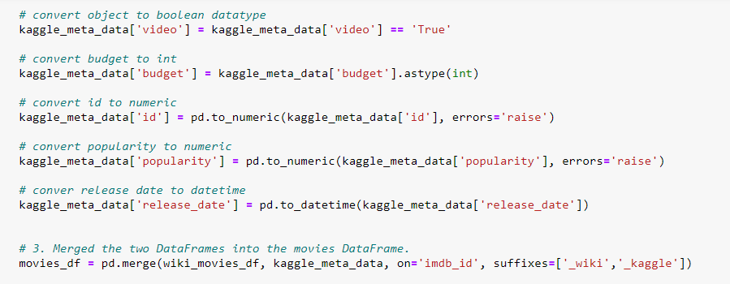

# Movies_ETL

## Resources
Python 3.7.9, jupyeter notebook 6.1.4, postgreSQL 11.10, pgAdmin 4.29, SQLAlchemy

## Overview

The purpose of this project is to extract, transform, and load data about various movies from separate sources into a movies SQL database to make available for a hackathon.  I used a jupyter notebook to explore data scraped from the sidebars of movies' wikipedia pages into a JSON file.  Columns with equivalent data were combined, tv shows were dropped, null values dropped or replaced, data forms-such as dates in various formats and dollar amounts represented with words million or billion-were transformed and made more consistent, and data types were corrected.  Below is a sample of code used clean the "Length" column, which held the length of each movie listed in various text formats such as "1 hour 15 min" or "120 minutes", creating a new "running_time" column with length given in total minutes in with a numerica datatype.

From that cleaned data, a wiki_movies_df was created.  

I then performed similar cleaning tasks on a csv file of movie metadata from from MovieLens and merged the kaggle and wikipedia movies dataframes.

The below image shows the code used to change datatypes in the kaggle dataset then merge the two dataframes:

I cleaned the merged dataframes by consolidating data from similar columns and dropping redundant columns.  Below is an image of code consolidating columns, including a list of redundant columns and choices for a resolution for redundant column in the comments:

I then created a dataframed of ratings fore each movie pulled from a csv file also compiled by MovieLens.  This dataframe was merged into the existing dataframe of wiki and kaggle data.

Finally, I exported the merged movies_df and the ratings.csv to a SQL database for use in the hackathon.

All of the exploratory cleaning, merging, and exporting to SQL are done in the ETL_create_database.ipynb file.

I then refactored the code used to transform and clean all the data into a more concise function that could be used to extract, transform, and load data from these same sources for potential use for future hackathons.  That function is created in the ETL_create_database.ipynb file.